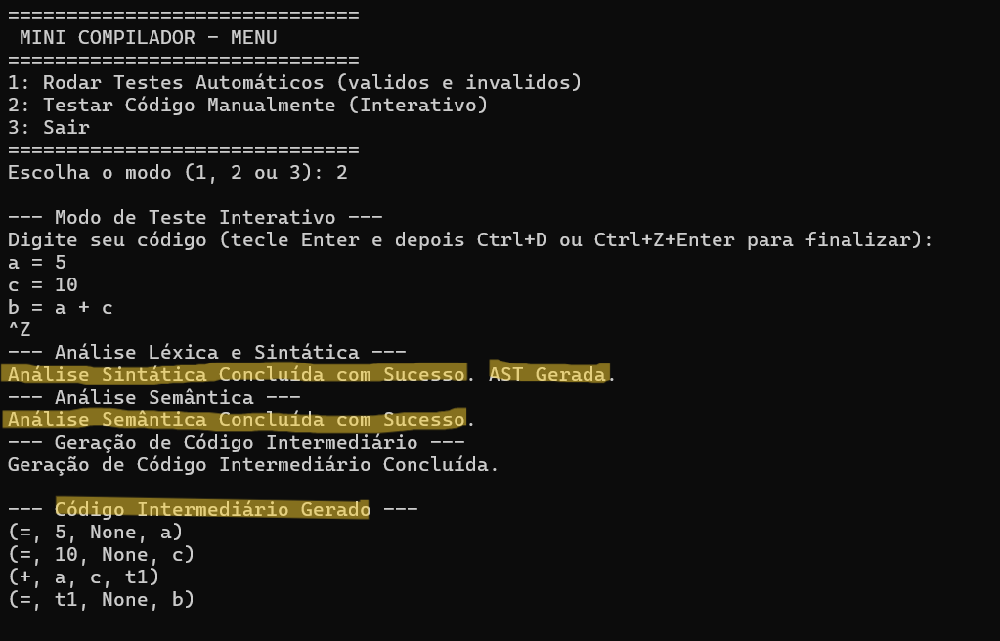
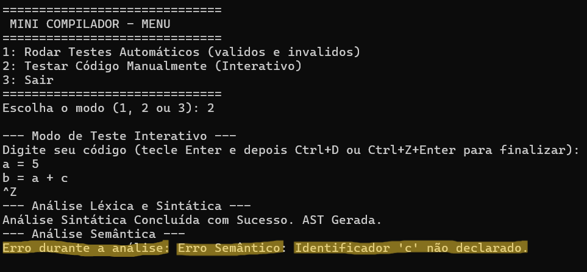

# Relatório Final do Projeto: Mini Compilador para Linguagem de Expressões Funcionais

## 1\. Introdução

Este relatório documenta o desenvolvimento de um mini compilador, conforme solicitado no projeto de PCG da disciplina de Compiladores. O objetivo principal foi construir um compilador capaz de analisar e traduzir uma linguagem de expressões matemáticas com suporte a funções definidas pelo usuário, variáveis, operadores aritméticos e escopo simples.

A implementação foi realizada em **Python**, utilizando a biblioteca **PLY (Python Lex-Yacc)** para as fases de análise léxica e sintática, o que permitiu uma construção eficiente e modular do compilador.

Este arquivo fornece uma contextualização detalhada do funcionamento do código-fonte e dos resultados obtidos, com foco especial na estrutura de testes e na demonstração das principais etapas de implementação do compilador.

### O PASSO A PASSO PARA EXECUTAR ESTE PROJETO ESTÁ CONTIDO NO README.md 

## 2\. Arquitetura e Implementação

O compilador foi estruturado em quatro fases principais, seguindo o modelo clássico de compilação: Análise Léxica, Análise Sintática, Análise Semântica e Geração de Código Intermediário.

### 2.1. Análise Léxica (`src/lexer.py`)

O analisador léxico, implementado com `ply.lex`, é responsável por ler o código-fonte e convertê-lo em uma sequência de _tokens_.

| Token | Expressão Regular | Descrição |
| :-- | :-- | :-- |
| `FUNCAO` | `funcao` | Palavra reservada para declaração de função. |
| `ID` | `[a-zA-Z_][a-zA-Z_0-9]*` | Identificadores de variáveis e funções. |
| `NUM_INT` | `\d+` | Números inteiros. |
| `NUM_FLOAT` | `\d+\.\d+` | Números de ponto flutuante. |
| Operadores | `+`, `-`, `*`, `/`, `^` | Operadores aritméticos. |
| Símbolos | `(`, `)`, `,`, `=` | Símbolos de agrupamento e atribuição/definição. |

### 2.2. Análise Sintática (`src/parser.py`)

O analisador sintático, construído com `ply.yacc` (utilizando a abordagem LALR), verifica a estrutura gramatical do código e constrói a **Árvore de Sintaxe Abstrata (AST)**. A gramática suporta as seguintes construções:

*   **Declaração de Função**: `funcao ID ( [ListaIDs] ) = Expressao`
*   **Atribuição**: `ID = Expressao`
*   **Expressões**: Combinação de literais, identificadores, chamadas de função e operadores binários (`+`, `-`, `*`, `/`, `^`) e unários (`-`).

A AST é representada por uma classe `Node`, que armazena o tipo do nó, seus filhos e um valor literal (folha).

### 2.3. Análise Semântica,  Verificação de Tipos e Escopo (`src/semantic_analyzer.py`)

A fase semântica percorre a AST para realizar verificações de correção que não são tratadas pela sintaxe.

*   **Tabela de Símbolos**: Utiliza uma `SymbolTable` com escopo simples (global e escopo local para parâmetros de função) para armazenar identificadores e seus tipos (`NUMERICO` ou `FUNCAO`).
*   **Verificação de Escopo**: Garante que todos os identificadores usados (variáveis ou funções) foram previamente declarados.
*   **Verificação de Chamada de Função**: Confirma se o número de argumentos passados em uma chamada de função corresponde ao número de parâmetros definidos.
*   **Verificação de Tipo**: Simplificada para garantir que todas as operações e atribuições envolvam o tipo `NUMERICO` (inteiros ou ponto flutuante).

### 2.4. Geração de Código Intermediário (`src/intermediate_code_gen.py`)

O gerador de código intermediário traduz a AST para o formato de **Código de Três Endereços (Quadruplas)**.

| Operação | Formato da Quadrupla | Descrição |
| :-- | :-- | :-- |
| Atribuição | `(=, arg1, None, result)` | `result = arg1` |
| Binária | `(op, arg1, arg2, result)` | `result = arg1 op arg2` |
| Chamada | `(CALL, func_id, num_args, result)` | `result = func_id(args)` |
| Parâmetro | `(PARAM, arg, None, None)` | Empilha um argumento para a chamada. |
| Retorno | `(RETURN, temp, None, None)` | Retorna o valor da expressão. |
| Rótulo | `(LABEL, None, None, label_id)` | Define o início de uma função. |

## 3\. Testes e Resultados

O compilador pode ser testado a partir do script `src/main.py`. Nele é disponibilizado dois tipos de testes: 

`1 - Teste Automático` - Rodando automáticamente os testes válidos e inválidos da pasta "tests"

`2 - Teste Interativo` - Digitando na mão o código que deseja ser validado pelo compilador 

### 3.1. Teste Válido (Exemplo de Saída)

Os códigos de teste a seguir foram compilados com sucesso:

#### Primeiro:

    funcao f(x, y) = x^2 + y
    a = 10
    b = 3.14
    c = f(a, b) / 2
    

**Código Intermediário Gerado:**

| Op | Arg1 | Arg2 | Result |
| :-- | :-- | :-- | :-- |
| `LABEL` | `None` | `None` | `FUNC_f` |
| `^` | `x` | `2` | `t1` |
| `+` | `t1` | `y` | `t2` |
| `RETURN` | `t2` | `None` | `None` |
| `END_FUNC` | `None` | `None` | `f` |
| `=` | `10` | `None` | `a` |
| `=` | `3.14` | `None` | `b` |
| `PARAM` | `a` | `None` | `None` |
| `PARAM` | `b` | `None` | `None` |
| `CALL` | `f` | `2` | `t3` |
| `/` | `t3` | `2` | `t4` |
| `=` | `t4` | `None` | `c` |

#### Segundo: 

    a = 5
    c = 10
    b = a + c

### 3.2. Teste Inválido (Exemplo de Erro)

#### Primeiro:

O teste de erro semântico para a expressão `x = y + 1` (onde `y` não foi declarado) resultou na falha esperada:

> Erro durante a análise: Erro Semântico: Identificador 'y' não declarado.

#### Segundo:

    a = 5
    b = a + c 

## 4\. Conclusão

O mini compilador atende a todos os requisitos especificados no projeto, implementando as quatro fases principais de compilação para a linguagem de expressões funcionais definida. A estrutura modular em Python e o uso de PLY garantem a clareza e a manutenibilidade do código.

## 5\. Arquivos do Projeto

Todos os arquivos de código-fonte e testes estão incluídos na entrega.

| Arquivo | Descrição |
| :-- | :-- |
| `src/lexer.py` | Analisador Léxico (PLY/Lex). |
| `src/parser.py` | Analisador Sintático (PLY/Yacc) e definição da AST. |
| `src/semantic_analyzer.py` | Análise Semântica e Tabela de Símbolos. |
| `src/intermediate_code_gen.py` | Geração de Código de Três Endereços. |
| `src/main.py` | Ponto de entrada, integração das fases e execução dos testes. |
| `tests/test_valid.txt` | Casos de teste com código válido. |
| `tests/test_invalid.txt` | Casos de teste com código inválido (erros léxicos/semânticos). |
| `README.md` | Descrição e arquitetura do projeto. |
| `RELATORIO_FINAL.md` | Este relatório. |
